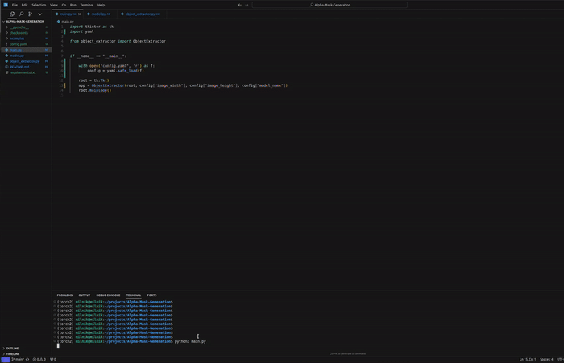

# Alpha-Mask-Generation

A Python application that allows users to extract objects from images and seamlessly place them onto virtual backgrounds using advanced segmentation and alpha masking techniques.

## Overview

This application combines the power of Segment Anything Model (SAM) with alpha masking to create high-quality image compositions. Users can select objects from source images using a simple bounding box interface and place them naturally onto any background image.

## Features

- Interactive GUI built with Tkinter
- Object selection via bounding box
- Real-time object scaling
- Smooth edge blending using alpha masking
- Support for various image formats (JPG, PNG, JPEG)
- Object positioning through point-and-click interface

## How It Works

### 1. Object Segmentation
- Users load a source image containing the object they want to extract
- A bounding box is then drawn by the user around the desired object
- The SAM model generates a mask of the object

### 2. Alpha Mask Generation
Alpha masking is a technique used to define the transparency of pixels in an image. The process works as follows:

1. **Mask Creation**: The SAM model generates a binary mask where:
   - 1 (white) represents the object pixels
   - 0 (black) represents the background pixels

2. **Edge Smoothing**: 
   - The binary mask edges are smoothed using Gaussian blur
   - This creates a gradual transition between the object and background
   - Smoothed edges help the object blend naturally with the new background

3. **Alpha Compositing**: 
   The final image is composed using the formula:
   ```
   Result = (Object × Alpha) + (Background × (1 - Alpha))
   ```
   Where:
   - Alpha is the smoothed mask (values between 0 and 1)
   - Object is the source image
   - Background is the virtual background image

### 3. Object Placement
- Users load a virtual background image
- Click to position the extracted object
- The object is automatically blended with proper edge transitions

## Installation

1. Clone the repository:

```
git clone git@github.com:milojkonikolic/Alpha-Mask-Generation.git
```
```
cd Alpha-Mask-Generation
```
2. Install required dependencies:
```
pip install -r requirements.txt
```

segment-anything library can be installed by running the following command:
```
pip install git+https://github.com/facebookresearch/segment-anything.git
```
The SAM model can be downloaded [here](https://github.com/facebookresearch/segment-anything?tab=readme-ov-file#model-checkpoints).

## Usage

1. In the ```config.yaml``` provide the ```image_width```, ```image_height```, and ```model_name``` (currenlty only "SAM" is supported). 

2. Run the application:
```
python3 main.py
```

3. Follow these steps:
   - Click "Load Object Image" to select your source image
   - Draw a bounding box around the object you want to extract
   - Click "Load Virtual Background" to select your background image
   - Click on the background to position your object
   - Click "Extract and Place Object" to generate the final composition

Example of the usage can be seen on the following video:


### Image Scaling and Edge Smoothing
- Supports object scaling from 0.1x to 5.0x. Maintains aspect ratio during scaling
- Multiple techniques are used to smooth the edges of the extracted object 
    - Mask Smoothing using Gaussian blur
    - Edge Detection and Smooting using ```dilate()``` and ```erode()``` from ```opencv```

## License
The project is licensed under the MIT License.

## Acknowledgments

- Segment Anything Model (SAM) by Meta AI Research
- OpenCV community for image processing tools
- Python Tkinter for the GUI framework
